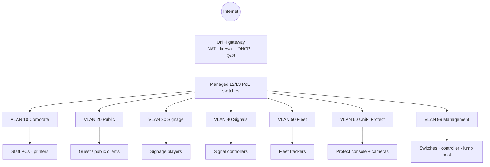

# Network Infrastructure Upgrade

**Computer Plus Solutions** · portfolio write-up by [Brice](https://github.com/supbrice)

Business network I designed and deployed: UniFi gateway, managed Layer 2/3 PoE switches, VLAN zoning (public / corporate / OT), UniFi Protect, NAT/QoS, and post-cutover validation.

Configs and addresses are **sanitized examples** that match the design — not a dump of a customer controller. This is a **client-sized** site, not a fake campus-scale estate.

Related background: IT support at **MTN** (DNS, DHCP, VPN, firewalls, endpoint monitoring, segmentation for 100+ users).

---

## Recruiter / interviewer — 30 seconds

| Prove | Where |
| --- | --- |
| Topology | Mermaid diagram below |
| VLAN plan (ID / purpose / subnet) | Table below · [`docs/vlan-plan.md`](docs/vlan-plan.md) |
| Isolation / NAT / QoS | Policy table below |
| Real troubleshooting | **[`docs/troubleshooting-scenarios.md`](docs/troubleshooting-scenarios.md)** (DNS, DHCP, VLAN, vendor path, L2 adoption) |
| Validation scripts | `scripts/validate_network.py` · `scripts/Test-NetworkHealth.ps1` |

---

## Problem

The site mixed staff PCs, guest/public access, and operational technology (digital signage, signals, fleet tracking) on a flat or poorly segmented LAN. Cameras and APs needed reliable PoE. Vendor-hosted OT needed outbound reach without a path into corporate traffic.

Goals:

1. Segment **public**, **corporate**, and **OT** traffic.
2. Power and backhaul UniFi Protect without starving other PoE devices.
3. Enforce NAT, routing, and QoS so OT and staff traffic could not freely mix.
4. Leave a repeatable way to prove links, DNS/DHCP, and zone isolation after cutover.

---

## Topology



---

## VLAN table

| Zone | VLAN | Subnet | Purpose |
| --- | --- | --- | --- |
| Corporate | 10 | `10.10.10.0/24` | Staff workstations, printers, file/print |
| Public | 20 | `10.10.20.0/24` | Guest / public Wi-Fi — internet only |
| OT Signage | 30 | `10.10.30.0/24` | Digital displays, content players |
| OT Signals | 40 | `10.10.40.0/24` | Signaling / control endpoints |
| OT Fleet | 50 | `10.10.50.0/24` | Vehicle / asset tracking gateways |
| Protect | 60 | `10.10.60.0/24` | UniFi Protect cameras and console |
| Management | 99 | `10.10.99.0/24` | Gateway, switches, controller, jump host |

Full DHCP/DNS options and switchport roles: [`docs/vlan-plan.md`](docs/vlan-plan.md) · [`docs/vlan-plan.csv`](docs/vlan-plan.csv)

---

## Isolation, NAT, and QoS

Default stance: **deny inter-VLAN**, then allow only what a zone needs.

| From | To | Policy |
| --- | --- | --- |
| Public | Anywhere except internet | Deny |
| Corporate | Internet | Allow via NAT |
| Corporate | OT / Protect | Deny (admin jump host on VLAN 99 only) |
| OT Signage / Signals / Fleet | Vendor-hosted destinations | Allow specific outbound; NAT |
| OT | Corporate / Public / other OT | Deny |
| Protect cameras | Protect console | Allow on VLAN 60 |
| Protect | Internet / Corporate | Deny |
| Management | All zones | Allow from jump host for ops |

QoS: signals/fleet highest · Protect reserved · corporate default · public lowest.

Example rules: [`configs/unifi/firewall-and-nat.md`](configs/unifi/firewall-and-nat.md) · [`configs/unifi/networks.json`](configs/unifi/networks.json)

---

## Troubleshooting (hire signal)

Five written scenarios from this work:

1. DNS mismatch on guest vs corporate  
2. DHCP lease on the wrong VLAN  
3. OT → corporate isolation failure  
4. Vendor path down while WAN is up (NAT/firewall, not “VPN magic”)  
5. UniFi Layer 2 adoption / stale inform loops  

Full write-ups: **[`docs/troubleshooting-scenarios.md`](docs/troubleshooting-scenarios.md)**  
Adoption runbook: [`docs/adoption-and-validation.md`](docs/adoption-and-validation.md)

---

## PoE and UniFi Protect

- Per-switch power budget vs camera + AP draw ([`docs/poe-budget.csv`](docs/poe-budget.csv) · [`scripts/poe_budget.py`](scripts/poe_budget.py))
- Cameras: PoE + access VLAN 60; uplinks tagged trunks
- Confirm FE (100 Mbps) where copper will not train at gigabit — still enough for Protect streams if the link is clean

Port notes: [`configs/unifi/protect.md`](configs/unifi/protect.md)

---

## Validation

```bash
python3 scripts/validate_network.py --plan docs/vlan-plan.csv --profile demo
```

```powershell
./scripts/Test-NetworkHealth.ps1 -Plan docs/vlan-plan.csv -Profile demo
```

`--profile demo` = off-site public targets. `--profile live` = VLAN gateways + vendor hostnames in the plan.

Monitoring: UniFi controller (offline / PoE / adopt / WAN) + scheduled script runs. No Prometheus/Grafana on this project.

---

## Repository layout

```
docs/       VLAN plan, PoE budget, adoption + troubleshooting scenarios
configs/    Example UniFi networks, firewall/NAT/QoS, Protect notes
scripts/    Python + PowerShell validation, PoE calculator
```

## What this is not

Not AWS/GCP/Jenkins. Not invented SLAs or “40% faster” claims. Not a production controller export.

## Contact

[linkedin.com/in/ngubriceche](https://www.linkedin.com/in/ngubriceche) · [github.com/supbrice](https://github.com/supbrice)
