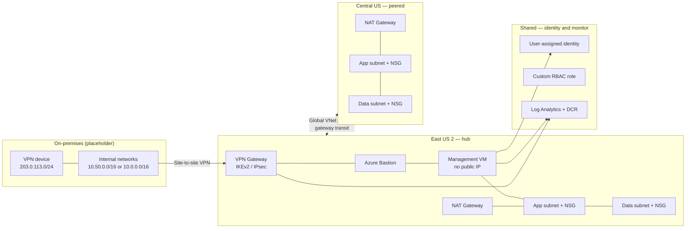

# Multi-region Azure hybrid infrastructure and zero-trust identity

Portfolio lab by **Brice** ([supbrice](https://github.com/supbrice)), Systems and Infrastructure Administrator. Azure Solutions Architect Expert (November 2024) and Azure Administrator Associate (September 2024). CCNA track.

This repository is a **Terraform lab**, not a record of a live customer or employer deployment. It turns the identity, hybrid networking, and IaC work I did as a Systems Administrator at nVent HOFFMAN (Anoka, MN, March 2021–August 2022) into a reviewable, lintable codebase: VNets and NSGs, a site-to-site VPN hub, Entra ID / RBAC placeholders, a management VM with no public IP, and Azure Monitor / Log Analytics hooks.

I have spent nearly a decade operating enterprise networks, Azure-based environments, and production systems with a 90%+ SLA focus. This lab is how I show that experience as infrastructure-as-code. It does **not** claim that this exact stack ran in production at nVent or anywhere else.

## What this demonstrates versus nVent / Azure work

| This lab | Related experience |
| --- | --- |
| Modular Terraform for Azure networking, identity, compute, and monitoring | IaC pipelines using Terraform, Python, and PowerShell |
| Site-to-site VPN gateway, local network gateway, IKEv2 IPsec policy | Hybrid cloud and site-to-site / VPN operations |
| Deny-Internet NSGs, NAT Gateway, Bastion, no public IP on the VM | Firewalls, least-privilege network paths, hybrid access |
| Private DNS zone plus an on-premises resolver record | DNS/DHCP operations in mixed environments |
| User-assigned managed identity, custom RBAC role, optional Entra groups | Azure access controls and identity |
| Log Analytics, data collection rule, Azure Monitor Agent, VPN metric alert | Endpoint / infrastructure monitoring and incident-ready telemetry |
| GitHub Actions `fmt` + `validate` (no Azure secrets) | Repeatable IaC checks before anyone talks to a subscription |

Operational tools from the rest of my work (ServiceNow, Salesforce, NICE, Genesys) are out of scope here. They belong in ticketing and contact-center operations, not in an Azure network stack.

## What this is not

- Not a production subscription, and not something I applied against nVent or any employer tenant.
- Not AWS, GCP, Kubernetes, Jenkins, or Prometheus. Those are not part of this skill set as presented here.
- Not a full Entra ID Conditional Access or PIM rollout. Those are tenant-wide controls (typically Entra ID P1/P2). The identity module documents them as the layer you would put on top of this RBAC model; it does not create them.

## Architecture

Primary region **East US 2** is the hybrid hub (VPN gateway, Bastion, management VM). Secondary region **Central US** is peered and uses the hub gateway (`use_remote_gateways`). On-premises is represented by a local network gateway and RFC 5737 documentation addresses.



Zero-trust choices in this lab:

1. Workloads have no public IPs. Outbound internet from mgmt/app/data goes through NAT Gateway.
2. Human SSH to the management VM is via Azure Bastion or the hybrid tunnel, not a public SSH rule.
3. NSGs allow only the next hop that needs access (Bastion/on-prem to mgmt, mgmt/on-prem to app, app to data). Internet inbound is explicitly denied.
4. The VM uses a user-assigned managed identity instead of stored client secrets.
5. RBAC is scoped to lab resource groups. Operator and reader assignments take Entra group object IDs you supply; they are empty in the committed lab values.
6. Syslog, performance counters, NSG diagnostics, and a VPN bandwidth alert land in one Log Analytics workspace.

## Repository layout

```text
.
├── terraform/
│   ├── main.tf                 # stack: wires modules, peering, private DNS
│   ├── variables.tf
│   ├── outputs.tf
│   ├── modules/
│   │   ├── networking/         # VNet, subnets, NSGs, NAT, optional Bastion
│   │   ├── hybrid-vpn/         # VPN gateway, local network gateway, S2S
│   │   ├── identity/           # managed identity, custom RBAC, optional groups
│   │   ├── compute/            # Linux management VM + Azure Monitor Agent
│   │   └── monitoring/         # Log Analytics, DCR, diagnostics, alerts
│   └── environments/
│       ├── dev/
│       └── prod/
├── .github/workflows/
│   ├── terraform-lint.yml      # terraform fmt
│   └── terraform-plan.yml      # terraform validate (no Azure credentials)
├── scripts/validate.sh
└── README.md
```

`dev` and `prod` are the Terraform roots. They call the stack module with different address spaces, SKUs, retention, and Bastion SKU. Both use a **local** backend so `terraform validate` works without Azure storage or secrets.

| | dev | prod |
| --- | --- | --- |
| Address spaces | 10.10.0.0/16, 10.20.0.0/16 | 10.100.0.0/16, 10.200.0.0/16 |
| VPN SKU | VpnGw1 / Generation1 | VpnGw2 / Generation2 |
| Bastion | Basic | Standard |
| VM size / zone | Standard_B1s / none | Standard_B2s / zone 1 |
| Log retention | 30 days | 90 days |

## How to use

Requires Terraform 1.6+ (CI uses 1.9.8) and, for plan/apply only, an Azure CLI login and a real subscription.

```bash
# Format and validate both environments (no Azure credentials)
./scripts/validate.sh

# Or by hand
terraform -chdir=terraform/environments/dev init -backend=false
terraform -chdir=terraform/environments/dev validate
terraform fmt -check -recursive terraform
```

Committed `terraform.tfvars` files use a dummy subscription GUID, a lab SSH public key, a placeholder IPsec key, and `ops@example.com`. That is enough for `validate`. It is **not** enough for a safe apply.

If you apply this in your own subscription:

1. Replace `subscription_id`, `admin_ssh_public_key`, `vpn_shared_key`, and `alert_email`.
2. Put the IPsec key in an untracked `*.secret.tfvars` file or a pipeline secret. Do not commit a real shared key.
3. Set `operations_group_object_id` / `security_readers_group_object_id` to existing Entra groups, or set `create_entra_groups = true` only if you intend to create groups in that tenant.
4. Change the on-premises gateway address from `203.0.113.0/24` documentation IPs to the real peer.
5. Expect the VPN gateway create to take 30–45 minutes. This lab is designed so you can review the code without paying for that.

```bash
az login
terraform -chdir=terraform/environments/dev init
terraform -chdir=terraform/environments/dev plan
# apply only against a subscription you own
```

A production pipeline would use an `azurerm` remote backend, a service principal or OIDC federation, and a change ticket in something like ServiceNow before apply. Those credentials are intentionally absent here.

## Identity notes (honest scope)

The identity module creates:

- A user-assigned managed identity for the management VM
- A custom role, `hybrid-network-operator`, with read-focused Microsoft.Network and Insights actions
- Optional assignments to Entra groups you already have
- Optional Entra security groups, **off** by default

Conditional Access (device/network/user conditions) and PIM (eligible vs permanent privileged roles) are the remaining zero-trust identity controls. I treat them as directory policy, not as something this lab should mutate in a random tenant. See `terraform/modules/identity/README.md`.

## CI

GitHub Actions runs `terraform fmt -check -recursive` and `terraform validate` on `dev` and `prod` after `terraform init -backend=false`. No `ARM_*` secrets are required. The workflow file is named `terraform-plan.yml` to match a typical IaC repo; the job is validate only.

## License

Reviewable portfolio code. Use it as a reference; do not treat it as a production runbook.
