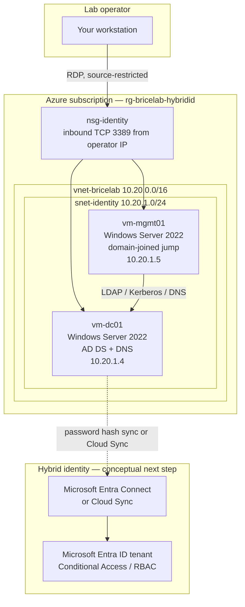

# Hybrid Identity Lab: On-Premises AD DS on Azure VMs

**Author:** Brice ([GitHub @supbrice](https://github.com/supbrice) · [LinkedIn](https://www.linkedin.com/in/ngubriceche))

Portfolio lab that stands up a small **on-premises Active Directory Domain Services** forest on **Azure virtual machines**, then treats that forest as the source of identity for a hybrid Microsoft Entra ID design.

This is the identity-and-access skill set I used as a System Administrator at **nVent HOFFMAN**: Azure access controls, Active Directory and Group Policy, hybrid operations, and PowerShell. It is **not** an nVent environment and **not** a Microsoft product.

> **Disclaimer:** This is a personal portfolio lab, not a production domain. Use it to learn and to talk through design decisions with a hiring manager. Do not copy the single-DC layout, lab passwords, or wide-open remote access into a real organization.

---

## Why this repository exists

This repo started as a community tutorial fork whose README was still placeholder lorem ipsum and imgur screenshots. I rewrote it as **my** lab: named resources, a real architecture, followable Azure and Windows Server steps, and PowerShell I would actually run.

What a hiring manager should be able to do after reading this:

1. Recreate the Azure network and two Windows Server VMs.
2. Promote a new forest (`bricelab.local`) with DNS on the domain controller.
3. Build a small OU / group / user baseline that maps to least-privilege thinking.
4. Run identity hygiene checks (privileged groups, non-expiring passwords, stale accounts).
5. Explain how Microsoft Entra Connect or Cloud Sync would attach this forest to Entra ID.

---

## What you build

| Role | Name | OS | Private IP | Purpose |
| --- | --- | --- | --- | --- |
| Domain controller | `vm-dc01` | Windows Server 2022 | `10.20.1.4` (static) | AD DS + DNS, first DC in a new forest |
| Management jump | `vm-mgmt01` | Windows Server 2022 | `10.20.1.5` (static) | Domain-joined admin workstation |

| Azure object | Name | Notes |
| --- | --- | --- |
| Resource group | `rg-bricelab-hybridid` | Delete this one group to tear the lab down |
| Region | `eastus` | Change if you prefer; keep both VMs in the same region |
| Virtual network | `vnet-bricelab` | `10.20.0.0/16` |
| Subnet | `snet-identity` | `10.20.1.0/24` |
| NSG | `nsg-identity` | RDP (3389) from **your** public IP only |
| AD DS forest / domain | `bricelab.local` | NetBIOS `BRICELAB` |
| Routable UPN suffix (lab) | `bricelab.test` | Added after promotion so hybrid sync has a clean UPN |

---

## Architecture



The dashed line is intentional. This lab **builds the on-premises source of authority**. Connecting an Entra ID tenant is documented conceptually so you can discuss hybrid identity without standing up a second directory in this repo.

---

## Skills this lab demonstrates

- **Azure IaaS and access control** — resource group, VNet, static NICs, NSG scoped to an operator IP (the same “who can reach what” thinking as Azure RBAC, applied at the network edge).
- **Windows Server / AD DS** — new forest, DNS on the DC, OU design, security groups, a sample Group Policy.
- **PowerShell** — parameterized scripts for landing-zone deploy, forest promotion, baseline objects, and hygiene reporting.
- **Hybrid identity literacy** — Entra Connect vs Cloud Sync, password hash sync vs pass-through authentication, what **not** to sync (Domain Admins, privileged groups).

---

## Prerequisites

- An Azure subscription you can create and delete resources in.
- PowerShell 5.1 or 7, plus the `Az` modules (`Az.Accounts`, `Az.Resources`, `Az.Network`, `Az.Compute`).
- Your current public IPv4 (the landing-zone script can detect it).
- About two hours the first time, plus a few dollars of Azure compute if you leave the VMs running.

**Cost control:** `Standard_B2s` / `Standard_B2ms` VMs are enough for this lab. Deallocate both VMs when you step away. Delete the resource group when you are done. A pair of B-series VMs left running 24/7 will surprise a personal subscription.

**Remote access:** The default is RDP from your public IP. Azure Bastion is a better pattern (no public IP on the VMs) if you want to spend a bit more and talk about jump-host design in an interview.

---

## Lab parameters

Keep these consistent across the portal, Azure PowerShell, and the in-guest scripts.

```powershell
$Lab = @{
    ResourceGroup   = 'rg-bricelab-hybridid'
    Location        = 'eastus'
    VnetName        = 'vnet-bricelab'
    SubnetName      = 'snet-identity'
    NsgName         = 'nsg-identity'
    DomainDnsName   = 'bricelab.local'
    DomainNetbios   = 'BRICELAB'
    UpnSuffix       = 'bricelab.test'
    DcName          = 'vm-dc01'
    DcPrivateIp     = '10.20.1.4'
    MgmtName        = 'vm-mgmt01'
    MgmtPrivateIp   = '10.20.1.5'
    LocalAdmin      = 'labadmin'   # Azure VM local admin, not a Domain Admin
}
```

Do **not** commit a real password. The scripts prompt for a `SecureString`.

---

## Deployment and configuration

### 1. Confirm your operator IP and sign in to Azure

From PowerShell on your workstation:

```powershell
Connect-AzAccount
Get-AzContext   # confirm subscription

# What the NSG will allow for RDP
Invoke-RestMethod -Uri 'https://api.ipify.org'
```

If you are on a home ISP, that address can change after a reboot of the router. Update the NSG source prefix if RDP suddenly fails.

### 2. Deploy the Azure landing zone

From the repo root, still on your workstation (Az module, **not** inside a VM yet):

```powershell
$adminPass = Read-Host -AsSecureString 'Local admin password for both VMs (complex, lab-only)'

.\scripts\New-AzureAdLabInfra.ps1 `
    -AdminUsername 'labadmin' `
    -AdminPassword $adminPass
```

The script creates the resource group, VNet, NSG, two public IPs, two NICs with **static private IPs**, and two Windows Server 2022 VMs.

**Do not set a conflicting static IPv4 inside the guest.** Azure DHCP will keep handing out `10.20.1.4` / `10.20.1.5` because the NICs are static in Azure. A second static config inside Windows that does not match the NIC is a common way to lose RDP.

### 3. RDP to the domain controller and rename if needed

In the portal, open `vm-dc01` → **Connect** → RDP, or use the public IP the script printed.

Sign in as `.\labadmin`.

```powershell
hostname   # should already be vm-dc01 from the Azure computer name
# If it is not:
# Rename-Computer -NewName 'vm-dc01' -Restart
```

Wait until the VM is back if you renamed it.

### 4. Promote the forest

Copy `scripts/Install-ADDSForest.ps1` to the DC (or clone this repo onto it) and run **elevated** PowerShell:

```powershell
.\Install-ADDSForest.ps1 -DomainName 'bricelab.local' -DomainNetbiosName 'BRICELAB'
```

The script:

1. Installs the **AD DS** role and management tools.
2. Prompts for the Directory Services Restore Mode (DSRM) password. Store it somewhere you control; it is the break-glass for AD, not your Azure local admin.
3. Creates a new forest with DNS on this server and reboots.

After reboot, sign in as `BRICELAB\labadmin` (the local admin was promoted into Domain Admins for this first DC — that is convenient for a lab and **wrong** for production. Step 6 creates a separate admin model).

Verify:

```powershell
Get-ADDomain | Select-Object DNSRoot, NetBIOSName, DomainMode
Get-ADForest | Select-Object Name, ForestMode, DomainNamingMaster
Get-WindowsFeature AD-Domain-Services, DNS | Select-Object Name, InstallState
Resolve-DnsName bricelab.local -Server 127.0.0.1
```

You want `InstallState = Installed` and a SOA/A record for the domain from the local DNS server.

### 5. Point the VNet at your new DNS

Azure VMs use Azure-provided DNS (`168.63.129.16`) until you change the VNet. Domain join will fail if `vm-mgmt01` cannot resolve `bricelab.local`.

On your workstation:

```powershell
$vnet = Get-AzVirtualNetwork -Name 'vnet-bricelab' -ResourceGroupName 'rg-bricelab-hybridid'
$vnet.DhcpOptions.DnsServers = @('10.20.1.4')
$vnet | Set-AzVirtualNetwork
```

Then **restart `vm-mgmt01`** so it picks up the new DNS. `vm-dc01` already hosts DNS and can keep using itself.

### 6. Build the identity baseline on the DC

Still on `vm-dc01`, elevated:

```powershell
.\New-LabIdentityBaseline.ps1
```

That script creates:

| Object | Purpose |
| --- | --- |
| `OU=Corp` plus Users, Workstations, Servers, Groups, ServiceAccounts | A place to apply GPO and (later) Entra Connect OU filtering |
| Global groups `GG-Helpdesk`, `GG-ServerOperators`, `GG-Tier0-Admins` | Role-shaped groups instead of dumping people into Domain Admins |
| `alice.user@bricelab.test` | Standard user |
| `bob.helpdesk@bricelab.test` | Helpdesk role (password reset / join workstation) |
| `tier0.admin@bricelab.test` | Dedicated privileged account — **lab Domain Admin** |
| GPO `Lab-LegalNotice` linked to `OU=Corp` | Shows Group Policy is in play (interactive logon text) |
| UPN suffix `bricelab.test` | Avoids syncing `*.local` UPNs to Entra ID |

The script prints one-time passwords to the console. Record them; they are not written to disk.

Interview talking point: at nVent I used AD + GPO for application and access baselines. Here the GPO is tiny on purpose. The **design** (OUs, role groups, a separate Tier 0 admin) is what I would defend in a real tenant.

### 7. Join the management server to the domain

RDP to `vm-mgmt01` as `.\labadmin`. Confirm DNS:

```powershell
Resolve-DnsName bricelab.local
Test-NetConnection 10.20.1.4 -Port 389
```

Then:

```powershell
Add-Computer -DomainName 'bricelab.local' -Credential (Get-Credential) -Restart
# Use BRICELAB\tier0.admin or BRICELAB\labadmin
```

After reboot, sign in as `BRICELAB\tier0.admin` and install the RSAT AD tools if you want to run hygiene from the jump box:

```powershell
Install-WindowsFeature RSAT-AD-PowerShell, GPMC
```

### 8. Run identity hygiene checks

On `vm-dc01` or `vm-mgmt01` (with the AD module):

```powershell
.\Invoke-IdentityHygieneChecks.ps1
```

The report flags:

- Members of **Domain Admins**, **Enterprise Admins**, **Schema Admins**, and **Administrators** (recursive).
- Users with **PasswordNeverExpires** or a blank/never-used password flag.
- Enabled users or computers with **LastLogonDate** older than 90 days (or never).
- Accounts with `adminCount = 1` (AdminSDHolder / privileged SD propagation).

In this fresh lab you should see `labadmin` and `tier0.admin` in Domain Admins, no stale accounts, and no `PasswordNeverExpires` users from the baseline script. The value is the **questions** the report asks, not a red dashboard.

Optional CSV:

```powershell
.\Invoke-IdentityHygieneChecks.ps1 -OutputCsv 'C:\Temp\bricelab-hygiene.csv'
```

### 9. Hybrid identity notes (Entra Connect / Cloud Sync)

This section is conceptual. I am not attaching a production Entra tenant in this repo.

**What “hybrid” means here**

- **On-premises AD DS** remains the source of authority for the users you just created.
- **Microsoft Entra ID** is the cloud directory used by Microsoft 365 and Azure RBAC.
- A sync engine copies (a filtered subset of) identities one way, then you apply **Conditional Access**, MFA, and Azure RBAC in the cloud.

**Two Microsoft sync products**

| | Microsoft Entra Connect (Connect Sync) | Microsoft Entra Cloud Sync |
| --- | --- | --- |
| Where it runs | A domain-joined Windows server you manage (often a dedicated box, **not** the only DC in production) | Lightweight agent; most logic in Microsoft’s cloud |
| Good fit | Complex rules, exchange hybrid, many customization scenarios | Simpler forests, multiple disconnected forests, less server upkeep |
| Lab choice | Easier to screenshot and talk through on one extra VM | Cleaner story if you already dislike extra Windows servers |

**Sign-in models (pick one to discuss)**

1. **Password hash synchronization (PHS)** — default for most labs. Entra ID stores a hash of the hash. Simple, resilient if the VPN to on-prem dies.
2. **Pass-through authentication (PTA)** — agents on-prem validate the password against AD. Useful when a password policy must stay on-premises.
3. **Federation (AD FS)** — extra servers; rarely the first lab.

I would start this lab with **PHS + Cloud Sync or Connect in staging mode**, then flip staging off after a dry-run.

**What I would sync (and what I would not)**

- Sync **`OU=Corp,DC=bricelab,DC=local`** only.
- Do **not** sync built-in privileged groups or `tier0.admin`. Cloud privileged roles are assigned in Entra ID (PIM in a real tenant).
- Use the **`bricelab.test` UPN**, not `bricelab.local`. Entra ID expects a verified custom domain for a clean sign-in (in a real tenant you would own that DNS zone).
- Keep a **cloud-only break-glass** Entra ID account that never depends on the sync engine.

**Access controls after sync (nVent-shaped)**

Once `alice.user` exists in Entra ID you can:

- Assign Azure RBAC at a resource-group scope (Reader on `rg-bricelab-hybridid` is a safe demo).
- Put a Conditional Access policy on the lab users: require MFA from unfamiliar locations.
- Keep server RDP off the public internet; prefer Bastion or a hybrid connection.

That is the same loop as production hybrid identity: **AD is the HR/source system, Entra ID is the policy enforcement point for cloud apps and Azure**.

### 10. Tear the lab down

When you are finished:

```powershell
Remove-AzResourceGroup -Name 'rg-bricelab-hybridid' -Force
```

Confirm in the portal that the group is gone so disks and public IPs stop billing.

---

## Scripts in this repo

| Script | Where you run it | What it does |
| --- | --- | --- |
| [`scripts/New-AzureAdLabInfra.ps1`](scripts/New-AzureAdLabInfra.ps1) | Workstation with Az module | Resource group, VNet, NSG, two Server 2022 VMs |
| [`scripts/Install-ADDSForest.ps1`](scripts/Install-ADDSForest.ps1) | `vm-dc01` as local admin | AD DS role + new forest |
| [`scripts/New-LabIdentityBaseline.ps1`](scripts/New-LabIdentityBaseline.ps1) | `vm-dc01` as a domain admin | OUs, groups, users, UPN suffix, sample GPO |
| [`scripts/Invoke-IdentityHygieneChecks.ps1`](scripts/Invoke-IdentityHygieneChecks.ps1) | DC or RSAT jump box | Privileged-group and stale-account report |

Each script has comment-based help (`Get-Help .\script.ps1 -Full`).

---

## Validation checklist

- [ ] NSG source prefix is your IP, not `0.0.0.0/0`.
- [ ] `Get-ADDomain` returns `bricelab.local`.
- [ ] `Resolve-DnsName bricelab.local` from `vm-mgmt01` hits `10.20.1.4`.
- [ ] `vm-mgmt01` shows a domain of `bricelab.local` in System Properties.
- [ ] Hygiene report lists only the privileged accounts you expect.
- [ ] You can explain PHS vs PTA and why Domain Admins stay out of Entra Connect.

---

## Troubleshooting

| Symptom | Likely cause | What to do |
| --- | --- | --- |
| RDP times out | ISP IP changed, or NSG is wrong | Re-run `api.ipify.org` and update the NSG source prefix |
| `Install-ADDSForest` fails on DNS | NIC DNS points at a public resolver only | After promotion the DC should use itself; VNet DNS is for the **other** VMs |
| Domain join cannot find the domain | VNet still on Azure DNS | Set VNet DNS to `10.20.1.4` and reboot `vm-mgmt01` |
| Domain join finds the domain but fails credentials | Using the Azure local account without the domain prefix | Use `BRICELAB\tier0.admin` or `BRICELAB\labadmin` |
| Guest lost connectivity after a “static IP” change | Static IPv4 set **inside** Windows that does not match the Azure NIC | Revert the guest to DHCP; keep the static assignment on the Azure NIC |
| GPO not applying on `vm-mgmt01` | Computer is not under `OU=Corp` | `Get-ADComputer vm-mgmt01`; move it to `OU=Servers,OU=Corp,...` and `gpupdate /force` |

---

## What I would do next (out of scope)

- A second DC in an availability zone (this lab has one DC on purpose).
- Azure Bastion and **no** public IPs.
- Microsoft Entra Cloud Sync agent on `vm-mgmt01` against a developer tenant, OU-filtered to `OU=Corp`.
- Privileged Identity Management for the cloud roles, not standing Domain Admin in Entra ID.
- Backup: Windows Server Backup of System State, or Azure Backup, plus a documented DSRM test.

---

## Attribution

- **Lab author:** Brice ([@supbrice](https://github.com/supbrice)).
- **History:** Forked from a public “configure AD on Azure” tutorial skeleton. The original README was unfinished placeholder text. This tree is a rewrite, not a Microsoft sample and not an official nVent project.
- **License:** MIT — see [LICENSE](LICENSE).
