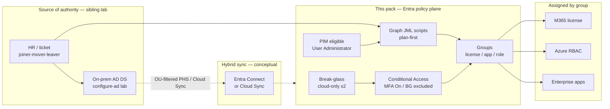

# entra-hybrid-proof

Hire-facing **Microsoft Entra ID + hybrid identity** proof pack by **Brice** ([@supbrice](https://github.com/supbrice)).

Azure Solutions Architect Expert (AZ-305, Nov 2024) · Azure Administrator Associate (AZ-104, Sep 2024).

**Portfolio:** [supbrice.github.io/portfolio](https://supbrice.github.io/portfolio/) · [LinkedIn](https://www.linkedin.com/in/ngubriceche)

> **LAB ONLY.** This is a personal interview pack for a disposable / developer tenant. It is **not** a customer tenant, **not** an employer tenant, and **not** a dump of production screenshots or live nVent configs. Career context (nVent-style Azure / Entra / IaC work) belongs in this README only — the evidence in `docs/` and `scripts/` is lab design + runnable-with-config PowerShell.

## 60-second proof

| Interview topic | What this repo shows | Open |
| --- | --- | --- |
| Conditional Access | MFA On for users; break-glass **excluded**; report-only before enforce | [docs/conditional-access.md](docs/conditional-access.md) |
| Break-glass | Two cloud-only emergency accounts; CA exclusion; sign-in alerting | [docs/break-glass.md](docs/break-glass.md) |
| PIM | Eligible **User Administrator** — activate, work, expire (no standing admin) | [docs/pim-user-administrator.md](docs/pim-user-administrator.md) |
| Group-based access | License groups vs app groups vs role groups; assign roles to groups | [docs/group-based-access.md](docs/group-based-access.md) |
| M365 admin | Group-based licensing + usage location (conceptual + Graph) | [docs/m365-admin-scenarios.md](docs/m365-admin-scenarios.md) |
| JML lifecycle | Joiner / mover / leaver PowerShell against Microsoft Graph | [scripts/](scripts/) |
| How I talk about it | Prod pattern vs lab limit vs tradeoff | [docs/interview-talk-track.md](docs/interview-talk-track.md) |

**Day 1 only.** Intune / Autopilot / device compliance is **out of scope** (Day 2). This pack stops at directory, CA, PIM, groups, M365 license patterns, and JML.

## What this proves vs what it does not

| Proves | Does not claim |
| --- | --- |
| I can design CA so MFA is default and break-glass still works | I enabled these policies in a production customer tenant |
| I can explain PIM eligible vs standing User Administrator | This repo mutates your PIM catalog if you clone it |
| I can write Graph JML that is config-driven and **plan-first** | The committed config is a live tenant |
| I understand hybrid: AD as source, Entra as policy plane | This repo stands up AD DS or Entra Connect (see sibling labs) |

Sibling labs (context, not required to run this pack):

- [configure-ad](https://github.com/supbrice/configure-ad) — AD DS forest on Azure VMs (on-prem source of authority)
- [Multi-Region-Azure-Hybrid-Infrastructure-Zero-Trust-Identity](https://github.com/supbrice/Multi-Region-Azure-Hybrid-Infrastructure-Zero-Trust-Identity) — Terraform hybrid network / RBAC
- [Azure-Cloud-Skills-and-Use-Cases](https://github.com/supbrice/Azure-Cloud-Skills-and-Use-Cases) — Entra / CA / RBAC reference labs

## Architecture (lab)

Hybrid identity in one picture: **AD (or HR) creates the person, Entra enforces the policy, groups carry the access, JML scripts keep the lifecycle honest.**



The dashed sync line is intentional. This repo does **not** install Connect. It documents how a hybrid joiner lands in Entra, then automates the **cloud** half of JML.

## Lab vs production

| | This lab | What I would do in production |
| --- | --- | --- |
| Tenant | Personal / developer tenant you own | Customer tenant with change control |
| CA state | Designed as **report-only first**, then `enabled` | Same, plus named locations / risk / device after inventory |
| PIM | Documented activate → expire story for User Admin | Eligible for all privileged roles; access reviews; approval |
| JML | Config JSON + `-WhatIf` default | Ticket ID, runbook, least-privilege Graph app, logging |
| Break-glass | Two cloud-only UPNs in config | Offline secrets, monitored, excluded from **all** lockout CA |
| Evidence | Markdown + scripts in GitHub | Tenant policies + change tickets — never pasted here |

nVent-style experience (Azure / Entra / Terraform / PowerShell, 2021–2022) is **career context**. Nothing in this tree is an nVent screenshot, export, or tenant ID.

## How to run / demo (10 minutes)

Scripts are **plan-first**. They print the Graph actions they would take. They do not write to a tenant unless you pass `-Execute` against **your** config.

```powershell
# PowerShell 7
cd scripts
Copy-Item config.example.json config.json   # edit UPNs / group names for YOUR lab tenant

# No Graph login required — review the plan
./Invoke-LabJmlDemo.ps1 -ConfigPath ./config.json

# Or one lifecycle at a time
./joiner/New-LabJoiner.ps1 -ConfigPath ./config.json
./mover/Set-LabMover.ps1   -ConfigPath ./config.json
./leaver/Invoke-LabLeaver.ps1 -ConfigPath ./config.json
```

Optional write path (your disposable tenant only):

```powershell
Install-Module Microsoft.Graph.Users, Microsoft.Graph.Groups, Microsoft.Graph.Users.Actions -Scope CurrentUser
Connect-MgGraph -Scopes "User.ReadWrite.All","Group.ReadWrite.All","Directory.Read.All"
./joiner/New-LabJoiner.ps1 -ConfigPath ./config.json -Execute
```

Interview demo: walk [docs/interview-talk-track.md](docs/interview-talk-track.md), open the CA / PIM docs, then run `Invoke-LabJmlDemo.ps1` so the reviewer sees a **plan**, not a fake CSV dump.

## Repository layout

```text
docs/                         # design notes (CA, PIM, groups, M365, talk track)
scripts/config.example.json   # safe placeholders — copy to config.json
scripts/common/               # shared Graph / config helpers
scripts/joiner|mover|leaver/  # one README + one script each
scripts/Invoke-LabJmlDemo.ps1 # runs all three in plan mode
```

## Honest limits (Day 1)

- No Intune, Autopilot, or device compliance policies.
- No committed tenant screenshots presented as production.
- Scripts use Microsoft Graph. They are not a full IGA product (no ServiceNow connector in-box).
- PIM and CA are **designed in docs**. Applying them is a portal / Graph step in *your* lab tenant after break-glass exists.

## License

MIT — see [LICENSE](LICENSE). Reference pack, not a production runbook.
